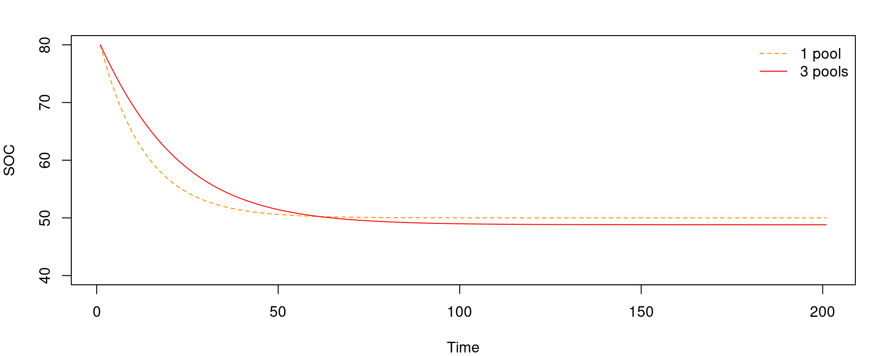

# The ICBM model philosophy

## The advantages of minimalism: introducing ICBM
ICBM is a rather minimalistic model with only two pools, one ($Y$) representing the young litter and another ($O$) representing the "old", or "humified", organic matter.  
The model is conceptually not so distant from Hénin and Dupuis model, and it becomes identical if the decay constant of the "young" pool, $k_y$, is set to $1$: all organic material coming to the soil is either instantly respired or transferred to the SOM.
```{tikz, fig.cap = "", fig.ext = 'png', fig.width=4.5}
\usetikzlibrary{arrows,automata} 
    \begin{tikzpicture}[shorten >=1pt,node distance=2.3cm,>=stealth',thick]
        \node[state] (1) {$O$};
        \node[state, left of=1] (d1) {$Y$};
        \coordinate[above of=1] (d2);
        \coordinate[above of=d1] (d0);
        \coordinate[left of=d1] (d00);
        \draw [->] (d00) to node[auto] {$I$} (d1);
        \draw [->] (d1) to node[auto] {$h \cdot k_y \cdot Y$} (1);
        \draw [->] (1) to node[auto] {$k_o \cdot O$} (d2);
        \draw [->] (d1) to node[auto] {$(1-h) \cdot k_y \cdot Y$} (d0);
    \end{tikzpicture}
    
```


## The advantages of minimalism: easily solved steady states
No system will accumulate or lose C indefinitely. The rates will always tend to zero.  
When the rate of SOC variation is zero, the system is in **equilibrium**, and inputs equal outputs. For example a land use change from a relatively rich environment (a forest) to an environment with less C inputs (agriculture). SOC will decrease over time until it reaches the new equilibrium:
```{r echo=FALSE, out.width="50%"}
X_0=50
k=0.1
tim=seq(1:100)
L=2
X=c(X_0,(L/k)*(1-exp(-k*tim))+X_0*exp(-k*tim))

plot(c(0,tim), X, type="l", ylim=c(0,55), ylab="C stocks", xlab="Time", yaxt="n", xaxt="n")
abline(h=X_0, lty=2, col="red")
text(10,X_0+1.2, "Initial steady state", col="red", cex=0.6)
abline(h=L/k, lty=2, col="darkgreen")
text(10,L/k+1.2, "Final steady state", col="darkgreen", cex=0.6)

```
The steady states are, by definition, where the rate of variation $\frac{dC}{dt}=0$. For a single pool model (Olson) this becomes easily solved. The steady state means that for a certain amount of C $C_{ss}$ the variation is zero: $0 = I - k \cdot C_{ss}$, which means $k \cdot C_{ss} = I$ and therefore $C_{ss}=\frac{I}{k}$.
  
A slightly more complicated model, like the two pool (Y and O) ICBM, has still relatively simple analyitcal solution:
$$
Y_{ss}=\frac{I}{k_y}\\
O_{ss}=\epsilon\cdot\frac{I}{k_o}
$$
Any linear model, with an arbitrary number of pools, has an analytical solution. But having it so short and easily manageable can sometimes be useful.

## The disadvantages of minimalism: loss in long-term accuracy

More pools define a more complex curve. This results in less approximation, and the models become more general.  
{width=70%}
For example a 1 pool model is not going to be able to represent the long-term trends of the more recalcitrant soil components well, and already on a few decades scale it can accumulate a significant error.  
When extrapolating on long time scales (several centuries or more) 3 or more pools are necessary (assuming we can initialize the model correctly).


# What model category belongs to?


```{r setup, include=FALSE}
knitr::opts_chunk$set(echo = FALSE)
```

# Hands-on: implementing ICBM as an ODE system
This is a very flexible approach for anyone who knows already some R basics because it allows us to build a model (any linear model, and to some extent also nonlinear) just by defining it as an ODE system.  
  
An ODE system is quite easy conceptually, particularly when compared to its analytical solution over time. This allows you to easily modify your models, adding or taking out terms depending on the hypotheses you want to represent.


## ICBM as ODE
We have seen this already but as a reminder here it is the model we want to implement:
$$
\frac{dY_{(t)}}{dt}=I - k_y \cdot r \cdot Y \\
\frac{dO_{(t)}}{dt}= h \cdot k_y \cdot r  \cdot Y  - k_o \cdot r  \cdot O
$$
  
Which can be conceptually visualized like this:
```{tikz, fig.cap = "", fig.ext = 'png', fig.width=3}
\usetikzlibrary{arrows,automata} 
    \begin{tikzpicture}[shorten >=1pt,node distance=2.3cm,>=stealth',thick]
        \node[state] (1) {$O$};
        \node[state, left of=1] (d1) {$Y$};
        \coordinate[above of=1] (d2);
        \coordinate[above of=d1] (d0);
        \coordinate[left of=d1] (d00);
        \draw [->] (d00) to node[auto] {$I$} (d1);
        \draw [->] (d1) to node[auto] {$h \cdot k_y \cdot Y$} (1);
        \draw [->] (1) to node[auto] {$k_o \cdot O$} (d2);
        \draw [->] (d1) to node[auto] {$(1-h) \cdot k_y \cdot Y$} (d0);
    \end{tikzpicture}
    
```

## Loading the solver

```{r, echo = TRUE}
library(deSolve)
```
This loads a pretty standard ODE solver library, which contains various numerical methods we are not going to dig into now.  
it is enough to know that it calculates the solution with numerical optimization (which is not exact but an approximation, so your results may vary ever so slightly depending on the seeds you set in R or on the different executions. It is a minimal variation anyway you can neglect).


## Setting up the model ODE to solve

```{r, echo = TRUE}
##function (differential form)
ODEfun <- function(time=seq(1:times_range), state=state, 
                   parms=parms) {
  with(as.list(c(state, parms)), {
    .Y=I-ky*r*Y
    .O=h*ky*r*Y-ko*r*O
    return(list(c(.Y, .O)))
  })
}
```
The order of the results will be the one specified in the output (`return(list(..., ..., ...))`).

## Definiting initial state and parameters
We need to define the initial state of the system. This is a vector containing one entry for each of the variables defined in the ODE, and the order should match.
```{r, echo = TRUE}
init=c(Y=2, O=10)
```
We then define all our model parameters (constants)
```{r, echo = TRUE}
parameters=c(ky=0.8, ko=0.0065, h=0.15, r=1, I=1)
```
And we specify the time vector for the solution. The time steps can be arbitraru big or small, not necessarily 1. The time unit is defined by the model (a certain parameterization will be in a specific time unit)
```{r, echo = TRUE}
time_vector=seq(0,100)
```

## Running the ODE within the solver 
We can now run our solver to find the integrated solution over time:
```{r, echo = TRUE}
simulation <- ode(y = init, time = time_vector, func = ODEfun, 
                  parms = parameters)
total_SOC=simulation[,2]+simulation[,3]
```

We have now a data frame with three columns, the first is time and the others are the solutions of our ODE in the order specified in the model definition. We can sum up the two pools to find the total SOC
```{r, echo = TRUE}
total_SOC=simulation[,2]+simulation[,3]
```

## Plotting the results
```{r pressure}
plot(simulation[,1], total_SOC,  type="l", ylim=c(0, max(total_SOC)*1.2), xlab="time", ylab="C")
lines(simulation[,2], col="darkgreen")
lines(simulation[,3], col="darkorange")
legend("topleft", c("Total SOC", "Y", "O"), bty="n", lty=1, pch=NA, col=c("black", "darkgreen", "darkorange"))
```

## What if?
For example, what if you wanted to modify the model adding one specific Y pool for roots and one for shoots?  

```{tikz, fig.cap = "", fig.ext = 'png', fig.width=5}
\usetikzlibrary{arrows,automata} 
    \begin{tikzpicture}[shorten >=1pt,node distance=3cm,>=stealth',thick]
        \node[state] (1) {$O$};
        \node[state, left of=1] (d1) {$Y_r$};
        \node[state, right of=1] (ys) {$Y_s$};
        \coordinate[above of=1] (d2);
        \coordinate[above of=d1] (d0);
        \coordinate[above of=ys] (ys0);
        \coordinate[left of=d1] (d00);
        \coordinate[right of=ys] (dys);
        \draw [->] (d00) to node[auto] {$I_r$} (d1);
        \draw [->] (dys) to node[auto] {$I_s$} (ys);
        \draw [->] (d1) to node[auto] {$h_r \cdot k_y \cdot Y$} (1);
        \draw [->] (ys) to node[auto] {$h_s \cdot k_y \cdot Y$} (1);
        \draw [->] (1) to node[auto] {$k_o \cdot O$} (d2);
        \draw [->] (d1) to node[auto] {$(1-h_r) \cdot k_y \cdot Y$} (d0);
        \draw [->] (ys) to node[auto] {$(1-h_s) \cdot k_y \cdot Y$} (ys0);
    \end{tikzpicture}
    
```

## What if?
You can then just define the model as an ODE system:
$$
\frac{dY_{r,}}{dt}= I_r - k_y \cdot r \cdot Y \\
\frac{dY_{s}}{dt}= I_s - k_y \cdot r \cdot Y \\
$$
We then have to define these fluxes into the O pool as a sum:
$$
\frac{dO}{dt}= h_r \cdot k_y \cdot r  \cdot Y_r + h_s \cdot k_y \cdot r  \cdot Y_s  - k_o \cdot r  \cdot O
$$
And now we are ready to write this system into the solver, and then we have our model.

## What if?
This is just an example. We assumed, among many other things, that the two `Y` pools decay at the same constant rate `k_y`, but this is not necessarily the case, it all depends on the hypothesis you want to test.  
You can think to virtually any hypothesis (provided it is fitting a compartmental linear model definition) and represent it with an ODE. And you can also go further (like nonlinear hypotheses) since `deSolve` also solves PDE systems, I would just not go there without knowing what you are doing in terms of the properties of the model object you are creating...
