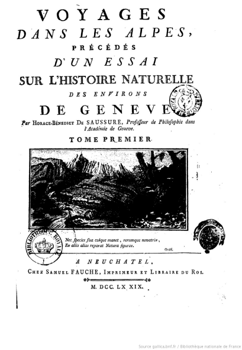
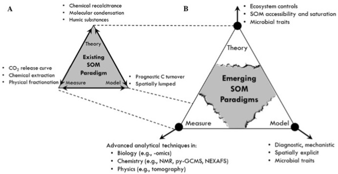
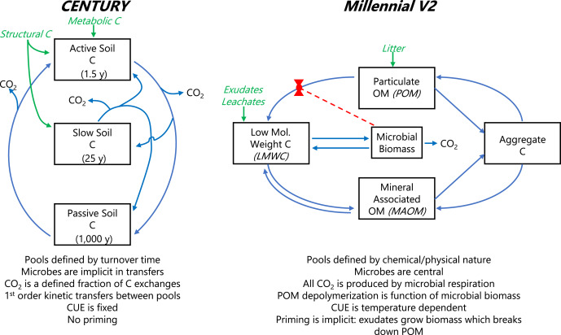

```{r setup, include=FALSE}
knitr::opts_chunk$set(echo = FALSE)
```
\
\

# History of SOC science

It is impossible to date when the idea of SOC, or something similar, was firsty devised, but here an extract from the **Kitab Al-Filaha**, a manual of agronomy written around the end of the 10th century by Ibn al-Awwam, a Muslim Spanish-Arab agriculturist, probably the most complete treatise written on the subject of agriculture and agronomy in medieval times.

*CHAPTER II.*
*Of manure and its species; of their usefulness, preparation, and how to use them and apply them. Refer to the trees and vegetables, if they suffer, or not, the manure; all taken from the book of Ebn-Hajáj, in which under the name of sirjin he deals with manure*  

*Manure, says Junio, makes the good land of better quality, while the bad land is greatly benefited and strengthened.*. 

{height=50%}
  
\
\

## Soil organic matter gets scientific 
Later on, SOC starts to become object of sistematization, as in the following extract from 1804:  

  {height=50%}


Some systematic observations about SOM:  

1. since no continuous accumulation of SOM occurs even with continuous organic inputs, some of these inputs must be destroyed,
2. the amount which is destroyed must, to a certain extent, be proportional to the absolute existing amount,
3. limits to SOM accretion must vary depending on climate, nature of mother bedrock, vegetation, cropping system and fertility of the land,
4. even if all conditions are favorable to SOM accumulation, there must be a maximum for the thickness of the humus layer beyond which destructive causes equal productive ones.
\
\

## Soil organic matter gets attention (1938)

A more structured approach to understand its nature initiated during past century:

{width=70%}

*Waksman, S.A., 1938. Humus. Origin, Chemical Composition and Importance in Nature, second ed. revised. Williams and Wilkins, Baltimore, p. 526*

But this is still an attempt to investigate its nature, not its dynamics.

\
\


## The Beginning of the conventional SOC decay theory (1945)
Hénin and Dupuis are probably the first to conceptualize a SOC ($C_s$) decay model describing SOC dynamics, or its evolution over time, as a function of its inputs ($C_i$) and decay rate ($k$):
$$
\frac{dC_s}{dt} = h \cdot C_i - k \cdot C_s
$$
In their formulation, the inputs to the SOC are defined by the C inputs $C_i$ times a humification constant $h$.

```{tikz, fig.cap = "", fig.ext = 'png', fig.width=5.5}
\usetikzlibrary{arrows,automata} 
    \begin{tikzpicture}[shorten >=1pt,node distance=2cm,>=stealth',thick]
        \node[state] (1) {$C_s$};
        \coordinate[left of=1] (d1);
        \coordinate[right of=1] (d2);
        \draw [->] (d1) to node[auto] {$h \cdot C_i$} (1);
        \draw [->] (1) to node[auto] {$k \cdot C_s$} (d2);
    \end{tikzpicture}
    
```
\
\

## The Beginning of the conventional SOC decay theory (1963)
<div class="columns-2">
  <div class="centered">
  {width=50%}
  </div>

Jerry Olson stated in the incipit of his SOC modeling paper: *"The net rate of change in energy or material stored in an ecological system or its parts equals the **rate of income** minus the **rate of loss**."*

```{tikz, fig.cap = "", fig.ext = 'png', fig.width=2.5}
\usetikzlibrary{arrows,automata} 
    \begin{tikzpicture}[shorten >=1pt,node distance=2cm,>=stealth',thick]
        \node[state] (1) {$C_s$};
        \coordinate[left of=1] (d1);
        \coordinate[right of=1] (d2);
        \draw [->] (d1) to node[auto] {$I$} (1);
        \draw [->] (1) to node[auto] {$k \cdot C_s$} (d2);
    \end{tikzpicture}
    
```

And described it mathematically with a linear differential equation very similar to Hénin and Dupuis model:
$$
\frac{dC_s}{dt} = I - k \cdot C_s
$$
Compared to Hénin and Dupuis, the term $I$ substitutes $h \cdot C_i$, but since $h$ is anyway a latent variable the two models are virtually the same. **Such equation is still the basis for most SOC models available around.**
</div>
\
\

## Differences between Olson and Hénin & Dupuis
While Olson's model is actually a single pool model, Hénin & Dupuis define the input flux to the soil as a fraction of the total C input $C_i$, which can describe the litter. When considering the implicit fluxes from the system (respiration), in order to close the mass balance, we need to account also for the respiration from the litter:

```{tikz, fig.cap = "", fig.ext = 'png', fig.width=3.5}
\usetikzlibrary{arrows,automata} 
    \begin{tikzpicture}[shorten >=1pt,node distance=2cm,>=stealth',thick]
        \node[state] (1) {$C_s$};
        \coordinate[left of=1] (d1);
        \coordinate[above of=1] (d2);
        \coordinate[above of=d1] (d0);
        \coordinate[left of=d1] (d00);
        \draw [->] (d00) to node[auto] {$C_i$} (d1);
        \draw [->] (d1) to node[auto] {$h \cdot C_i$} (1);
        \draw [->] (1) to node[auto] {$k \cdot C_s$} (d2);
        \draw [->] (d1) to node[auto] {$(1-h) \cdot C_i$} (d0);
    \end{tikzpicture}
    
```

\
\

## Many many many many SOC models

A **(badly incomplete)** list of the major (only linear ones, we'll come to this later) SOC models over time:

```{tikz, fig.cap = "", fig.ext = 'png', fig.width=10.5}
\usetikzlibrary{mindmap,shadows}

\begin{tikzpicture}[]
  
  % limits
  \newcount\yearOne; \yearOne=1940
  \def\w{15}    % width of axes
  \def\n{7}     % number of decades
  \def\lt{0.40} %  ten tick length
  \def\lf{0.36} % five tick length
  \def\lo{0.30} %  one tick length
  
  % help functions
  \def\yearLabel(#1,#2){\node[above] at ({(#1-\yearOne)*\w/\n/10},\lt) {#2};}
  \def\yearArrowLabel(#1,#2,#3,#4){
    \def\xy{{(#1-\yearOne)*\w/\n/10}}; \pgfmathparse{int(#2*100)};
    \ifnum \pgfmathresult<0
      \def\yyp{{(\lt*(0.90+#2))}}; \def\yyw{{(\yyp-\lt*#3)}}
      \draw[<-,thick,black,align=center] (\xy,\yyp) -- (\xy,\yyw) node[below,black] at (\xy,\yyw) {#4};
    \else
      \def\yyp{{(\lt*(0.10+#2)}}; \def\yyw{{(\yyp+\lt*#3)}}
      \draw[<-,thick,black,align=center] (\xy,\yyp) -- (\xy,\yyw) node[above,black] at (\xy,\yyw) {#4};
    \fi}
  
    \def\yearArrowLabelRed(#1,#2,#3,#4){
    \def\xy{{(#1-\yearOne)*\w/\n/10}}; \pgfmathparse{int(#2*100)};
    \ifnum \pgfmathresult<0
      \def\yyp{{(\lt*(0.90+#2))}}; \def\yyw{{(\yyp-\lt*#3)}}
      \draw[<-,thick,black,align=center] (\xy,\yyp) -- (\xy,\yyw) node[below,red] at (\xy,\yyw) {#4};
    \else
      \def\yyp{{(\lt*(0.10+#2)}}; \def\yyw{{(\yyp+\lt*#3)}}
      \draw[<-,thick,black,align=center] (\xy,\yyp) -- (\xy,\yyw) node[above,red] at (\xy,\yyw) {#4};
    \fi}
  
  % axis
  %\draw[thick] (0,0) -- (\w,0);
  \draw[->,thick] (-\w*0.03,0) -- (\w*1.03,0);
  
  % ticks
  \foreach \tick in {0,1,...,\n}{
    \def\x{{\tick*\w/\n}}
    \def\year{\the\numexpr \yearOne+\tick*10 \relax}
  	\draw[thick] (\x,\lt) -- (\x,-\lt) % ten tick
	             node[below] {\year};
	
	\ifnum \tick<\n
	  \draw[thick] ({(\x+\w/\n/2)},0) -- ({(\x+\w/\n/2)},\lf); % five tick
      \foreach \ticko in {1,2,3,4,6,7,8,9}{
        \def\xo{{(\x+\ticko*\w/\n/10)}}
  	    \draw[thick] (\xo,0) -- (\xo,\lo);  % one tick
	}\fi
  }
  
  % label
  \yearArrowLabelRed(1945, 1.0,1.0,Hénin and Dupuis model)
  \yearArrowLabelRed(1963, 1.0,1.0,Olson model)
  \yearArrowLabel(1996, 1.0,1.0,CANDY)
  \yearArrowLabel(1987, 1,1.5,Century)
  \yearArrowLabel(1991, 1,0.5,DAISY)
  \yearArrowLabel(2005, 1,1.0,Yasso)
  \yearArrowLabel(2001, 1,2.0,ROMUL)
  \yearArrowLabel(1992, 1,2.3,DNDC)
  \yearArrowLabel(1987, -1,2,RothC)
  \yearArrowLabel(1977,-1.0,2.0,\small RothC core idea )
  \yearArrowLabel(1997, -1,2.4,ICBM)
  \yearArrowLabel(1996, -1,1.3,Q)

  
\end{tikzpicture}
```

A relatively recent literature review (Campbell and Paustian 2015) found **87** different SOM models (and this not considering broader models, like complete ecosystem models, and more speculative studies on SOM model structures)

\
\

## The Golden Era: RothC (1977)
When computer power started to be reasonably available, more complex models trying to represent SOC in more detail arised. In the decades between the late 70s and late 90s the foundations of most currently used SOC models were laid. 
  {height=300}

## The Golden Era: Century (1987)
  <div class="centered">
{width=65%}
  </div>

These models rely mathematically on the same principle enunciated by Hénin and Dupuis or Olson, but involve more pools. These pools are used to represent various hypotheses to modify the initial first-order kinetic assumption, ultimately to represent better the data available for calibrating the model. And none of them is really right or wrong, or better in absolute terms.


\
\

## The problem of model initialization

<div style="background-color:lightgrey; padding:10px;">
  <p>Jargon: "steady state" means that the system is in equilibrium so the variation of the C stocks is zero: C in the soil stays constant.
</p>
</div>

"Model initialization" means to specify the initial state of the system, at time zero (which means at the beginning of our simulation).. For multi-compartment models, this requires determining the initial size of each pool.  
There are multiple ways to realize this, but **the information problem is always the same: we need to infer the pool distributions by assuming a long past history in each site, in order to know all C inputs to the soil before the start of our simulation (or, if not all, long in the past)**. We can assume steady state at the beginning and therefore constant inputs (averaging the data we have and assuming that before inputs were more or less those), or we can assume variable inputs repeating the data we have for the present assuming that the same rotations were used in the past, but the problem is in any case usually that we do not know much about past inputs and we need to be ready to make strong assumptions.  
Methods are in general:  

* Solved steady state: an analytical solution is fed with the average C inputs, assumed constant, to determine pool distribution and SOC stocks
* Spin-up runs: as above, but instead of analytically solving the model we run it for very long time. we can eityher use average inputs, assumed constant, repeated for every time step, or in this case also variable inputs. IN this case it is a quasi-steady state, because until the inputs are variable we will never have a real steady state.

These methods are essentially details about a specific implementation, but no one solves the information problem above. They might be better suited to your specific case and the assumptions you are ready to make.

\
\


## The dream of "data-based" initialization: soil organic matter "quality"
The pools of compartmental models represent different "qualities" of SOC molecules. This made sense when we believed that chemistry alone was governing their turnover, for example light fractions were supposed to be more labile and heavy fractions more recalcitrant. But we now know that turnover is an interaction of chemical, edaphical and biological factors. SOC "quality" is a continuous spectrum, and such spectrum is also highly nonlinear because many processes influences it. For example, we can have at some point a switch, like a critical moisture, that turns off one protection mechanism.  
Pools could have been something representing (as an approximation) a physical reality if this continuum was linear, but on a highly nonlinear continuum this assumption shows even more problems. **In other words, it is very difficult to know exactly to which kind of molecules a certain pool corresponds.**  

  {height=450}

\
\

## The dream of "data-based" initialization: Yasso, Zimmerman, etc...
Many models have developed around the idea of having measurable pools, or such idea developed afterwards with specific fractionation techniques.
  {height=300}
But any fractionation will be based on an assumed conceptual model defining recalcitrance, simplifying a lot the quality function and imposing assumptions already on the data.  
It kind of works, kind of doesn't.
  

\
\

## One possible tree of SOC models concepts
```{tikz, fig.cap = "", fig.ext = 'png', fig.width=5.5}

\usetikzlibrary{mindmap,shadows}

\begin{tikzpicture}
  \path[mindmap,concept color=black,text=white]
    node[concept] {SOC decay models}
    [clockwise from=0]
    child[concept color=green!50!black] {
      node[concept] {Linear}
      [clockwise from=95]
      child { node[concept] {Minimalist}}
      child { node[concept] {Lab-based initialization}}
      child { node[concept] {Inert} }
      child { node[concept] {Feedback} }
      child[concept color=orange] { node[concept] {continuous} }
    }
    child[concept color=red] { node[concept] {Nonlinear} }

;
\end{tikzpicture}
```

## Are we "breaking" SOC paradigm?

Organic matter has been studied for centuries through different "phases": from natural observation ("humus", pre-1840) to chemical concepts ("humic substances" and fraction, 1840-1940s) to mosre recent ecological concepts (1940-), recognizing more and more the complex relationships between SOM and environment. Some see it as **paradigm shift**, some see it as **evolution**.

```{tikz, fig.cap = "", fig.ext = 'png', fig.width=10.5}
\usetikzlibrary{mindmap,shadows}

\begin{tikzpicture}[]
  
  % limits
  \newcount\yearOne; \yearOne=1820
  \def\w{19}    % width of axes
  \def\n{21}     % number of decades
  \def\lt{0.40} %  ten tick length
  \def\lf{0.36} % five tick length
  \def\lo{0.30} %  one tick length
  
  % help functions
  \def\yearLabel(#1,#2){\node[above] at ({(#1-\yearOne)*\w/\n/10},\lt) {#2};}
  \def\yearArrowLabel(#1,#2,#3,#4){
    \def\xy{{(#1-\yearOne)*\w/\n/10}}; \pgfmathparse{int(#2*100)};
    \ifnum \pgfmathresult<0
      \def\yyp{{(\lt*(0.90+#2))}}; \def\yyw{{(\yyp-\lt*#3)}}
      \draw[<-,thick,black,align=center] (\xy,\yyp) -- (\xy,\yyw) node[below,black] at (\xy,\yyw) {#4};
    \else
      \def\yyp{{(\lt*(0.10+#2)}}; \def\yyw{{(\yyp+\lt*#3)}}
      \draw[<-,thick,black,align=center] (\xy,\yyp) -- (\xy,\yyw) node[above,black] at (\xy,\yyw) {#4};
    \fi}
  
    \def\yearArrowLabelRed(#1,#2,#3,#4){
    \def\xy{{(#1-\yearOne)*\w/\n/10}}; \pgfmathparse{int(#2*100)};
    \ifnum \pgfmathresult<0
      \def\yyp{{(\lt*(0.90+#2))}}; \def\yyw{{(\yyp-\lt*#3)}}
      \draw[<-,thick,red,align=center] (\xy,\yyp) -- (\xy,\yyw) node[below,red] at (\xy,\yyw) {#4};
    \else
      \def\yyp{{(\lt*(0.10+#2)}}; \def\yyw{{(\yyp+\lt*#3)}}
      \draw[<-,thick,red,align=center] (\xy,\yyp) -- (\xy,\yyw) node[above,red] at (\xy,\yyw) {#4};
    \fi}
  
  % axis
  %\draw[thick] (0,0) -- (\w,0);
  \draw[->,thick] (-\w*0.03,0) -- (\w*1.03,0);
  
  % ticks
  \foreach \tick in {0,1,...,\n}{
    \def\x{{\tick*\w/\n}}
    \def\year{\the\numexpr \yearOne+\tick*10 \relax}
  	\draw[thick] (\x,\lt) -- (\x,-\lt) % ten tick
	             node[below] {\year};
	
	\ifnum \tick<\n
	  \draw[thick] ({(\x+\w/\n/2)},0) -- ({(\x+\w/\n/2)},\lf); % five tick
      \foreach \ticko in {1,2,3,4,6,7,8,9}{
        \def\xo{{(\x+\ticko*\w/\n/10)}}
  	    \draw[thick] (\xo,0) -- (\xo,\lo);  % one tick
	}\fi
  }
  
  % label
  \yearArrowLabel(1830, 2.0,2.0, Hundesdhagen - humus layer classification )
  \yearArrowLabel(1881, -3,5.0, C. Darwin, Formation of vegetable
mould through the action of worms)
  \yearArrowLabel(1889, 1.5,1.0, Müller - mull, mor, moder )
  \yearArrowLabel(1913, 1,1, Maillard)
  \yearArrowLabel(1937, 3,2, Tyurin - processes are soil specific)
  \yearArrowLabelRed(1936, -3,1, Waksman  - humic fractions)
  \yearArrowLabel(1961, 2.5,5.0, Kononova - soil organic matter bioformation theory)
  \yearArrowLabelRed(2011, -3.5,2.0, Schmidt et al.: persistence as an ecosystem property)
  \yearArrowLabelRed(2015, 2,2.0, Lehman and Kleber: we need to change)


  
\end{tikzpicture}
```

## Representing reality: the view of experimentalists
{width=70%}
*Schimel, Joshua. “Modeling Ecosystem-Scale Carbon Dynamics in Soil: The Microbial Dimension.” Soil Biology and Biochemistry 178 (March 2023)*

## Representing reality: the view of experimentalists
We know that SOC decomposition is process mediated by microbes, their growth and by their exoenzymes production, so representing these processes will produce more accurate models.  

{width=55%}
*Schimel, Joshua. “Modeling Ecosystem-Scale Carbon Dynamics in Soil: The Microbial Dimension.” Soil Biology and Biochemistry 178 (March 2023)*

## The cyclical discussion: is more realistic more better?
Making decomposition controlled by enzymes/microbes means making the model nonlinear, moving from ordinary differential equations to partial differential equations.

{width=60%}

Nonlinearities in models can lead to weird behaviors, for example oscillations. Because of the nonlinear (more than linear) effects, any mistake can have an amplificated effect on predictions.

## More complicated (nonlinear) models bring extrapolation uncertainty

{width=60%}
Shi, Zheng, Sean Crowell, Yiqi Luo, and Berrien Moore. “Model Structures Amplify Uncertainty in Predicted Soil Carbon Responses to Climate Change.” Nature Communications 9, no. 1 (June 4, 2018)

## Scary: linear algebra for linear models
Compartmental models can be expressed within a generic linear algebra (matrix) notation
$$
\frac{dC_{(t)}}{dt}=I_{(t)} + A_{(t)} \cdot C_{(t)}
$$
For example the ICBM model (assuming constant average inputs), written explicitly, is:
$$
 \frac{dC_{(t)}}{dt}=\begin{bmatrix} I\\  0\\  \end{bmatrix} +
  \xi \cdot
    \begin{bmatrix} -k_y & \epsilon \\ 0 & -k_o  \end{bmatrix} \cdot
    \begin{bmatrix} Y \\ O \end{bmatrix}
$$
This notation allows us to generalize the main differences between model structures:
```{r}

df <- data.frame (first_column  = c("$I+\\xi \\cdot A \\cdot C_{(t)}$", "$I+\\xi \\cdot A (C_{(t)}) \\cdot C_{(t)}$"),
                  second_column = c("$I+\\xi_{(t)} \\cdot A \\cdot C_{(t)}$", "$I+\\xi (t) \\cdot A (C_{(t)}) \\cdot C_{(t)}$")
                  )
colnames(df)<-c("Autonomous", "Non-autonomous")
rownames(df)<-c("Linear", "Non-linear")
  
knitr::kable(df)
```

(it brings also the pretty neat advantage of an easy nalytical steady state for anything linear...)
